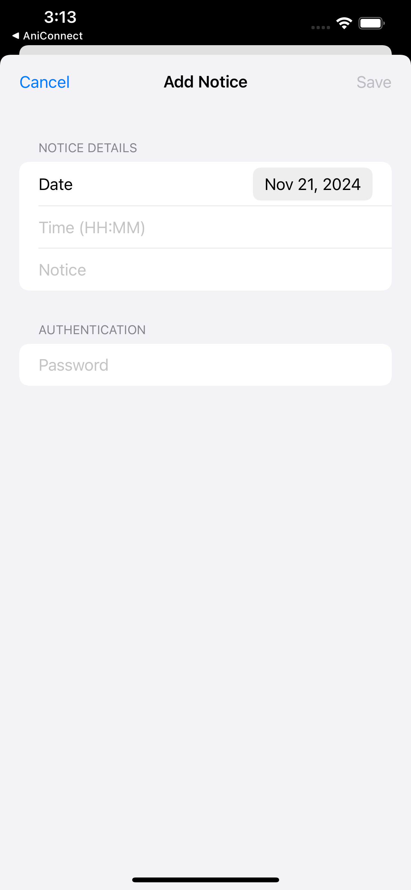

# Virtual CR

Virtual CR is a simple iOS application designed to streamline communication between Class Representatives (CR) and students. The app allows CRs to add notices and CT (Class Test) announcements, while students can view these updates effortlessly.

## Features

- **Notice Management**: CRs can add notices with important updates.
- **CT Announcements**: Add details like date, place, course, and topic for upcoming CTs.
- **Simple Authentication**: Secure access for CRs using password authentication.
- **Student Access**: Students can view all notices and CT announcements.

## Backend

The backend is a simple Node.js server deployed on **Google Cloud**.  I've used Sqlite3 for this simple database.

The Backend is deployed at -  [Class Management Dashboard - api.34.29.68.223.nip.io](https://api.34.29.68.223.nip.io/) 
Backend Repo - [Faysal-Kuet/virtual_CR_backend: Backend for CSE 3218 Assignment 1](https://github.com/Faysal-Kuet/virtual_CR_backend)

### API Routes:

- **View Notices**:  
  `GET` https://api.34.29.68.223.nip.io/api/ct-announcements

- **View CT Announcements**:  
  `GET` https://api.34.29.68.223.nip.io/api/notices

- **Add Notice**:  
  `POST` https://api.34.29.68.223.nip.io/add-notice

- **Add CT**:  
  `POST`  https://api.34.29.68.223.nip.io/add-ct-announcement  


## Screenshots

### App Interface
<table>
  <tr>
    <td></td>
    <td></td>
  </tr>
  <tr>
    <td></td>
    <td></td>
  </tr>
</table>


## Author
```
Faysal Mahmud
KUET CSE 2k20
3rd Year, 2nd Term
Roll - 2007068
```
